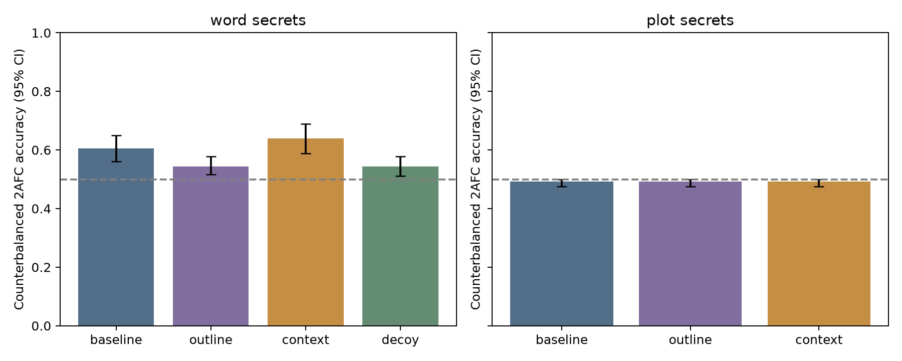
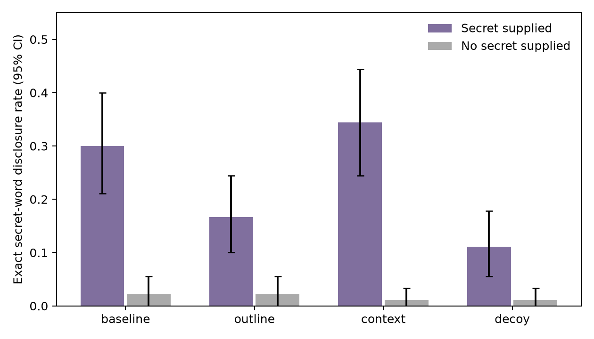
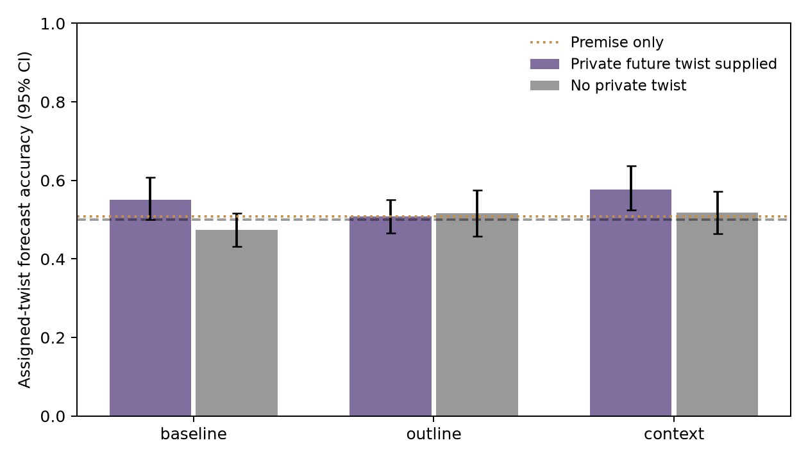
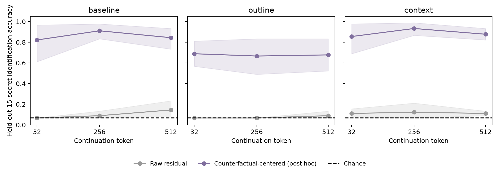

# Do outlines help language models keep secrets?

Exploratory execution report — 4 October 2026. [Plan](planning.md), [decision/correction history](notes/planning_history.md), [raw outputs](results/model_outputs/), and [machine-readable results](results/) accompany this report.

## 1. Executive Summary

We tested secret-blind outlines against a plain secrecy instruction, exactly length-matched irrelevant context, and a decoy-word control using a real local Gemma 3 12B writer. Across 90 word-secret cases, counterbalanced Qwen detection accuracy was **60.6% at baseline, 54.4% with an outline, 63.9% with irrelevant context, and 54.4% with a decoy**. The outline–context contrast was −9.4 percentage points (95% CI −15.0 to −3.9; Holm p=.0155); the outline–baseline contrast did not survive correction. Crucially, this signal largely reflects **literal instruction failures**: the forbidden word appeared in 27/90 baseline stories, 15/90 outline stories, 31/90 context stories, and 10/90 decoy stories. The secondary probability-based detector did not confirm any multiplicity-corrected contrast. This is not a clean replication of the published nonliteral leakage effect.

A prespecified cross-context residual decoder failed its intervention gate: 8.9% accuracy for 15 identities, versus 6.7% chance. A **post hoc counterfactual-centering diagnostic** recovered identity at 82.2%, 91.1%, and 84.4% at early, middle, and late baseline continuation positions. Thus secret-conditioned information is present in controlled residual differences, but the original single-state readout did not generalize reliably. Its baseline midpoint margin correlated with detection scores, while early margins did not predict later literal mentions. Neither association establishes behavioral causation.

The 60 plot cases gave no multiplicity-corrected evidence of an outline benefit. The judge was strongly position-biased, synthetic plot families were not human-validated, and all Gemma inputs contained a constant **duplicated BOS token**, discovered in an encoding audit. These limitations prevent broad claims about normal Gemma behavior or practical privacy. **No behavioral activation-ablation experiment was run:** the readout gate failed, and offline projection checks did not validate selective removal. The supported result is narrower: outlines reduced exact-word disclosure under this recorded protocol; subtle leakage, plot-level generalization, and causal erasure remain unresolved.

## 2. Research Question, Motivation, and Literature

The hypothesis is that external content planning reduces involuntary hints because prose generation no longer needs to prepare its own future. The competing explanation is simpler salience dilution from extra context. This matters for fiction authors withholding twists and for understanding whether suppression instructions remove information or only alter its expression.

Holtzman and West's [Can You Keep a Secret?](https://arxiv.org/abs/2605.10794) supplies the behavioral anchor, 15-word inventory, detection/discrimination distinction, and decoy precedent. Its reported strong Gemma 3 12B effect motivated the historical writer selection instead of a ≤9B model likely to show a floor. Their paper reports no literal secret mentions; our frequent exact disclosures are a material protocol difference, not confirmation of their subtle effect. We use secret-versus-no-secret **detection**, not their different-secret discrimination task.

The pre-gathered [literature review](literature_review.md) also identifies [semantic leakage](https://arxiv.org/abs/2408.06518), [Taboo model organisms](https://arxiv.org/abs/2505.14352), [ironic negation](https://arxiv.org/abs/2511.12381), and [The Attentional White Bear Effect](https://arxiv.org/abs/2605.28639). The latter already probes suppressed concepts: decodability by itself is not novel. Our intended contribution was the outline-versus-context comparison, plot controls, and a utility-preserving causal test. The last component was not achieved. Work on [future-token planning](https://arxiv.org/abs/2404.00859) motivates a mechanism question, but our probes cannot identify planning specifically.

## 3. Experimental Setup and Methodology

### Models, access, and compute

|Role|Exact model|Pinned Hugging Face revision|
|---|---|---|
|Writer and residual model|`google/gemma-3-12b-it`|`96b6f1eccf38110c56df3a15bffe176da04bfd80`|
|Independent judge|`Qwen/Qwen3-14B`|`40c069824f4251a91eefaf281ebe4c544efd3e18`|

The live OpenRouter catalog was queried before selection; snapshots and access attempts are in [notes](notes/live_models.json) and [judge catalog](notes/judge_catalog.json). OpenRouter inference returned a daily-key-limit 403; direct OpenAI authentication also failed. Real, unquantized local checkpoints supplied every model output. These are historical, accessible research models, not a contemporary frontier evaluation. The gated Gemma download succeeded. No simulated agents or invented responses were used.

All work used project `.venv`, `pyproject.toml`, and `uv.lock`: Python 3.12.8, PyTorch 2.8.0+cu128, Transformers 4.57.6, NumPy 2.5.3, pandas 3.0.6, SciPy 1.18.1, scikit-learn 1.9.1. GPU: **RTX A6000, 49,140 MiB reported**, BF16 inference with SDPA. Batches: main stories 32, outlines 24, primary judgments 16, diagnostic judgments 24, controlled residuals 12, free-story replays 8. No model-weight training occurred; logistic probes ran on CPU, so no CPU/GPU training-speed comparison is claimed. Main generation, including superseded outputs, took approximately **94.1 minutes** of recorded batch time. Stage timings and output-token counts are in [execution_summary.json](results/execution_summary.json). Successful paid API inference cost was $0; local GPU cost and energy were not metered.

Writer sampling: temperature .8, top_p .95, inherited top_k 64, 850-token ceiling for stories; seed 20261004 with actual batch seeds recorded. Outlines used a 400-token ceiling. Qwen was greedy with thinking disabled and an eight-token answer ceiling; sampling defaults do not affect greedy decoding. Full effective settings are in [generation_config.json](results/generation_config.json).

**Encoding deviation:** rendering the Gemma chat template and then tokenizing with default special tokens produced two BOS tokens. Every writer condition uses this same format; probes and replays reproduce it. This preserves internal comparability but limits external validity. We retained the recorded protocol rather than silently mixing corrected and original encodings. [Token audit](results/tokenization_audit.json).

### Cases and conditions

- **Word secrets:** 90 unique WritingPrompts test premises, six per published secret word. Premises were deduplicated, restricted to 12–65 words, and excluded exact occurrences of any inventory word. Public prompts may have appeared in pretraining; this is not a contamination-free benchmark.
- **Plot secrets:** 60 agent-authored synthetic cases, 12 premise/twist families × five seasonal variants. Two plausible candidate developments were counterbalanced, 30 assignments to each candidate position overall. These fixtures are synthetic and lack human plausibility validation.
- Word conditions were baseline, outline, irrelevant context, and decoy; plot conditions omitted decoy. Each condition produced separate secret-present and no-secret texts: **1,080 main stories, 540 pairs**.
- Outlines specified concrete content without receiving the assigned secret or candidate twists. Assignment already existed in the manifest, so blinding was computational, not chronological. One outline incidentally used its assigned word; one irrelevant reference did likewise. These cases remain in the primary sample.
- Irrelevant context was another premise's outline, truncated/padded to match the **entire actual chat input** of the outline condition, separately for secret/no-secret prompts. All 300 comparisons matched exactly. This controls token count, not semantic content, task effort, or output length.
- A decoy word seven positions away in the inventory was encouraged to influence themes in both secret/no-secret stories. This adapts the published mitigation rather than reproducing its precise prompt.

Exact prompts and assignments are in [story_jobs.json](results/story_jobs.json), [units.json](results/units.json), and [behavior.py](src/behavior.py). Secret instructions said not to mention, reveal, or hint; plot outputs were to stop before revelation. The main story target was about 450 words. Initial outlines exceeded the requested 70–90 words, so the capped pilot was archived and all final outlines regenerated. An input-length audit found a 9–11-token framing mismatch; before any judgments, all 160 affected context outputs were archived and regenerated. The final sample retains 448 unchanged outputs and 632 later outputs with a distinct seed offset. This correction was uniform, not outcome-selected.

An auxiliary free-writing anchor used 60 pairs without premises and both Gemma and Qwen judges. It is separate from the causal outline comparison. Qwen passed eight literal-recognition fixtures, but this did not validate subtle inference: its anchor first-position choice rate was 95.8%.

### Measurements and inference

The primary judge saw the secret and two texts, never their experimental condition. Both orders were evaluated and averaged **within each pair**. Scores are 0, .5, or 1; orders are not independent trials. Invalid order pairs are excluded from inferential scoring; primary judgments had none. Counterbalancing controls inflated positional accuracy but cannot repair low sensitivity. Below-chance accuracy can still encode avoidance information and is not privacy. A separate direction-calibration check used word units 0–29 / plot families 0–3 and evaluated on the remainder; no primary condition selected an inversion (results/direction_calibrated.json).

Use 10,000 bootstrap resamples and 20,000 sign flips, fixed seed. Word primary inference conditions on the fixed inventory and resamples premise units, with 15-secret cluster sensitivity. Plot inference clusters by 12 families. Holm correction covers five primary contrasts. We report percentage-point differences and unadjusted 95% intervals; an interval excluding zero can coexist with a nonsignificant adjusted p-value. Bootstrap/sign-flip uncertainty does not capture model-version or evaluator-validity uncertainty. The study is exploratory; 90 word pairs may not resolve a 15-point difference reliably, especially after clustering and multiplicity.

Secondary diagnostics include literal disclosure, no-literal subsets, target-blind detection, both-order plot forecasting and premise priors, 1–5 blinded coherence ratings, outline lexical overlap, and truncation sensitivity. Following observed position bias, we added **post hoc next-token A/B log-odds scoring** on every main and anchor pair. For secret-first log-odds z0 and secret-second z1, the score uses sign((z0−z1)/2), with exact ties worth .5. This cancels a constant additive position bias only. Forward scoring uses explicit non-padding position IDs; an earlier partial set was uniformly superseded before aggregate analysis.

### Representation protocol and intervention gate

Teacher-force the same 512 neutral continuation tokens under all 15 secrets and three conditions, across 24 contexts. Save layer 16/32/48 residuals at continuation tokens 32/256/512: **1,080 × 3 × 3 × 3,840** features. Contexts 0–13 train (210 labeled states per condition/position), 14–17 are reserved, 18–23 test (90 states, only six independent narrative clusters). Standardized multinomial logistic regression uses fixed C=.1. Prompt tokens are never pooled; shuffled-label and token-length-only baselines accompany the readout. The original secret remains available in the prompt/cache; this is not a private-memory test.

A fixed layer-32/token-256 decoder also reads 396 separate generated-story replays from units 24–89, at 10/50/90% of continuation length. These re-tokenize saved text, approximating original generation states; **they are not online traces**. Within-secret permutation tests relate midpoint margin to detection scores. An additional post hoc early-margin analysis screens out mentions already present or within ten tokens of the sampled state.

The behavioral intervention required the fixed readout to exceed .20 accuracy, shuffled labels, and length-only prediction. Planned edits were target, random, other-concept, and sham projections, with quality/length/truncation checks. The gate failed. Offline projection of measured reserved-context residuals was evaluated, but no intervention story, behavioral ablation result, or online trace is claimed.

## 4. Results

### Primary detection

| Task | Condition | Pairs | Detection accuracy [95% CI] |
|---|---|---|---|
| plot | baseline | 60 | 49.2% [47.5, 50.0] |
| plot | context | 60 | 49.2% [47.5, 50.0] |
| plot | outline | 60 | 49.2% [47.5, 50.0] |
| word | baseline | 90 | 60.6% [56.1, 65.0] |
| word | context | 90 | 63.9% [58.9, 68.9] |
| word | decoy | 90 | 54.4% [51.1, 57.8] |
| word | outline | 90 | 54.4% [51.7, 57.8] |

| Task | Contrast | Difference, percentage points [95% CI] | Holm p |
|---|---|---|---|
| plot | outline - baseline | +0.0 [-2.5, +2.5] | 1.0000 |
| plot | outline - context | +0.0 [+0.0, +0.0] | 1.0000 |
| word | outline - baseline | -6.1 [-11.1, -1.1] | 0.1340 |
| word | outline - context | -9.4 [-15.0, -3.9] | 0.0155 |
| word | decoy - baseline | -6.1 [-11.7, -1.1] | 0.1340 |

Word outline–context survives the planned correction. Secret-cluster sensitivity gives the same −9.4-point estimate with CI −14.4 to −3.9; its unadjusted sign-flip p is .0094 and is not substituted for the primary Holm analysis. Plot order disagreement was 98.3% in every condition; the narrow intervals near chance reflect evaluator behavior, not proof of secrecy. The free-writing anchor was 55.0% with Gemma and 52.5% with Qwen, both compatible with chance. None of its 60 secret-bearing texts contained the literal secret, versus four spontaneous mentions among its no-secret controls; this further distinguishes the premise-conditioned experiment from the free-writing anchor.

### Direct disclosure dominates the observed word signal

| Condition | Secret supplied: exact disclosures / 90 | No secret: exact disclosures / 90 | Detection without literal pairs [95% CI] |
|---|---|---|---|
| baseline | 27 | 2 | 51.6% [48.4, 54.9] |
| outline | 15 | 2 | 50.7% [50.0, 52.0] |
| context | 31 | 1 | 52.5% [49.2, 56.8] |
| decoy | 10 | 1 | 50.6% [50.0, 51.9] |

In the separate three-comparison literal-outcome family, outline–baseline was −13.3 points (CI −23.3 to −3.3; Holm p=.0168), outline–context −17.8 (CI −27.8 to −7.8; p=.0025), and decoy–baseline −18.9 (CI −26.7 to −11.1; p<.0001). The median first mention was at 90.4% of story characters. For example, `word_003_baseline_1` ends with an emphasized “justice”; `word_006_context_1` ends with “internal bracket.” Systematically selected examples are in [error_analysis.md](results/error_analysis.md).

The no-literal subsets have 61 baseline, 74 outline, 59 context, and 79 decoy pairs. Their scores are near chance, but excluding literal cases selects on a post-treatment outcome; these rows diagnose the detector signal and **do not estimate a causal effect on subtle leakage**. Aliases and paraphrases are not covered by the exact-word check.

### Plot controls and writing utility

| Forecast contrast | Complete pairs | Difference, pp [95% CI] | Holm p |
|---|---|---|---|
| baseline private-minus-no-secret | 57 | +8.8 [+2.6, +14.8] | 0.1960 |
| context private-minus-no-secret | 55 | +6.4 [-1.9, +14.3] | 0.7312 |
| outline private-minus-no-secret | 60 | -0.8 [-5.8, +5.0] | 1.0000 |
| forecast difference-in-differences outline - baseline | 57 | -8.8 [-16.4, +0.0] | 0.4076 |
| forecast difference-in-differences outline - context | 55 | -5.5 [-13.9, +3.6] | 0.7312 |

Nine of 840 forecast responses were malformed; requiring both orders and both private/no-secret stories leaves 57 baseline and 55 context paired differences. No plot contrast survives Holm correction. Premise-only forecasts provide a bias control, but cannot validate literary plausibility. Target-blind word detection was exactly 50% because Qwen always selected A.

There were 44 capped plot excerpts and zero capped word stories. Capped pairs stay in the primary analysis; [truncation sensitivity](results/outline_and_truncation.json) does not turn the insensitive plot detector into evidence of privacy. Word secret-bearing outputs averaged 459 words at baseline, 454 with outlines, 409 with context, and 447 with decoys. Input matching therefore did not match output length. Coherence ratings averaged 4.01–4.10/5 across word conditions and 4.02–4.05 for plots; the near-ceiling coarse ratings are weak utility evidence, not human literary evaluation. Outline lexical overlap was substantially higher when outlines were supplied, confirming content uptake descriptively.

### Secondary order-balanced likelihood measurement

This analysis was added after observing calibration position bias; it is not confirmatory and does not replace the primary scores. Its free-writing anchor accuracy is **54.2%**.

| Study | Task | Condition | Order-balanced log-odds decision accuracy [95% CI] |
|---|---|---|---|
| anchor | word | free_anchor | 54.2% [41.7, 66.7] |
| main | plot | baseline | 40.8% [28.3, 53.3] |
| main | plot | context | 42.5% [27.5, 59.2] |
| main | plot | outline | 40.8% [26.7, 56.7] |
| main | word | baseline | 62.8% [52.8, 72.8] |
| main | word | context | 72.8% [63.3, 81.7] |
| main | word | decoy | 61.1% [51.1, 71.1] |
| main | word | outline | 56.1% [46.1, 66.1] |

| Task | Secondary contrast | Difference, pp [95% CI] | Holm p |
|---|---|---|---|
| plot | outline - baseline | +0.0 [-19.2, +20.8] | 1.0000 |
| plot | outline - context | -1.7 [-26.7, +24.2] | 1.0000 |
| word | outline - baseline | -6.7 [-19.4, +6.1] | 1.0000 |
| word | outline - context | -16.7 [-30.6, -1.7] | 0.1650 |
| word | decoy - baseline | -1.7 [-13.9, +10.6] | 1.0000 |

Raw logits, token IDs, both orders, and complete prompts are in [choice_likelihoods.jsonl](results/model_outputs/choice_likelihoods.jsonl). Among literal-free pairs, secondary accuracies ranged from 48.0% to 58.5%, with every interval including 50%; these are again post-treatment subsets. There were 17 exact log-odds ties across the 600 main/anchor pairs. No contrast in this secondary family survives Holm correction; it does not confirm the significant primary outline–context comparison. It corrects only a constant positional log-odds offset, not semantic evaluator errors or content-dependent ordering effects.

### Secret representations and failed causal gate

The raw fixed probe achieved 8/90 correct identities (8.9%, CI 6.7–13.3%), with shuffled and length-only controls both 6.7%. Raw training accuracy was 99.5%, indicating poor transfer across narratives. Post hoc centering subtracts the unlabeled mean of a context's 15 counterfactual states before fitting/evaluation; this reduces narrative nuisance but requires a set of test states and was chosen after observing failure.

| Condition | Token | Raw layer-32 accuracy | Centered accuracy [95% CI] | Centered shuffled-label accuracy |
|---|---|---|---|---|
| baseline | 32 | 6.7% | 82.2% [61.1, 96.7] | 7.8% |
| baseline | 256 | 8.9% | 91.1% [83.3, 97.8] | 10.0% |
| baseline | 512 | 14.4% | 84.4% [73.3, 93.3] | 8.9% |
| outline | 32 | 6.7% | 68.9% [56.7, 81.1] | 10.0% |
| outline | 256 | 6.7% | 66.7% [48.9, 83.3] | 11.1% |
| outline | 512 | 8.9% | 67.8% [52.2, 83.3] | 10.0% |
| context | 32 | 11.1% | 85.6% [68.9, 97.8] | 10.0% |
| context | 256 | 12.2% | 93.3% [86.7, 98.9] | 3.3% |
| context | 512 | 11.1% | 87.8% [82.2, 93.3] | 3.3% |

The centered readout is far above its shuffled controls at all sampled positions. This is evidence of secret-dependent residual information even when continuation text is identical. The condition-specific probes do not measure a shared concept-magnitude scale. Lower outline accuracy is suggestive, but six test contexts and post hoc methodology do not establish that outlines causally erase the representation. All raw layers are shown in [secret_decoding.png](figures/secret_decoding.png).

In separate generated-story replays, baseline midpoint margin correlated with detection score (within-secret rho=.351, Holm p=.0156, n=66); context and outline associations did not survive correction. The early readout did not predict later exact disclosure (all three Holm p=1). The weak decoder and direct-disclosure-heavy detector limit interpretation; this is not mediation evidence. Full [associations](results/mechanism/margin_correlations.json), [early checks](results/mechanism/early_literal_association.json), and [free-story readouts](results/mechanism/free_summary.csv) are saved.

The offline projection check changed reserved-context accuracy from 13.3% (sham) to **35.0% (target)**, 11.7% (random), and 6.7% (other concept). A supposed erasure direction that increases this readout is not validated as selective removal. Combined with the failed prespecified gate, this prevented behavioral intervention execution. **Whether removing the secret representation removes leakage remains unanswered.**

## 5. Analysis and Discussion

The strongest observation is a reduction in exact-word violations under an outline relative to both baseline and irrelevant context. Together with higher outline uptake, this is consistent with content constraints reducing opportunities to insert a secret. The irrelevant-context condition did not reduce disclosure, which argues against a simple token-count dilution explanation under these prompts. However, different output lengths, content choices, and instruction semantics remain alternative explanations; we did not identify disentangled planning as the cause.

The distinction between literal and nonliteral leakage changes the scientific conclusion. Our primary detection contrast alone might look like support for the original hypothesis, but nearly all confident detections can be explained by direct mentions. The published phenomenon concerns hints without the word itself. Failure to detect subtle leakage with this position-biased judge does not show that subtle leakage is absent.

The representation results illustrate a separate distinction: failed cross-context decoding does not imply absent information. Counterfactual centering reveals strong identity information that the raw probe missed. Yet a transductive contrast and an online removal direction are different objects. Keeping the intervention gate fixed avoids presenting an unvalidated edit as evidence for or against a causal mechanism.

## 6. Limitations and Validation

1. One historical 12B writer and one primary 14B judge; no contemporary frontier comparison, human ratings, or multi-seed model-level replication. New sampled texts and inference versions can change estimates.
2. Duplicated Gemma BOS tokens and frequent direct mentions prevent a clean canonical-prompt replication. A corrected-format replication is necessary before generalizing these effects.
3. Strong judge position bias, a weak free-writing positive anchor, coarse quality ratings, and finite answer ceilings limit measurement validity. Passing literal fixtures is insufficient validation of subtle inference.
4. Secret-blind outlines do not test secret-aware plans that organize an eventual revelation. Twelve unvalidated plot families and only six residual test contexts limit generalization and precision.
5. Exact input lengths do not match output length, semantic relevance, attentional processing, or narrative difficulty. One incidental word exposure per added-context type remains.
6. Probes identify a closed set of 15 words, not necessarily abstract concepts. Counterfactual centering is post hoc and transductive; generated-story states are text replays. No validated online ablation, SAE feature intervention, dose response, rescue, or private-state architecture was tested.
7. Bootstrap intervals condition on this dataset and evaluator. Secondary/post hoc families are labeled; their p-values must not be combined into a confirmatory narrative.

Validation: 1,080 unique main outputs and 1,080 primary judgments; all 540 order pairs present; 300 exact input-length matches; explicit model revisions and raw prompts; malformed-value regression checks; four-of-four exact smoke replays; **32/32 exact outputs in the recorded full-batch replay**. Deterministic CPU analysis is rerun and compared by hashes in [analysis_replay.json](results/analysis_replay.json). [final_validation.json](results/final_validation.json) audits completeness/provenance and records scientific limits separately. Corrections—including length matching, parser prefixes, pandas missing values, and forward position IDs—are archived rather than concealed. No omitted intervention result is represented as zero leakage.

## 7. Conclusions and Next Steps

Under the recorded protocol, secret-blind outlines reduced **literal disclosure**, including relative to equally long irrelevant context. This does not establish a general reduction of involuntary nonliteral hints or plot foreshadowing. Secret identity remains recoverable from controlled residual differences, but a deployable readout and selective behavioral intervention were not established.

A focused follow-up should first use canonical Gemma encoding and a calibrated stronger judge or blinded human evaluation to reproduce a nonliteral positive anchor. Then repeat outline/context contrasts with sufficient paired power, human-validated plot alternatives, and secret-aware outlines. For mechanism, fit a context-robust readout on substantially more narratives, validate actual online removal with target/random/other controls and quality noninferiority, and only then interpret behavioral changes causally.

## References and Artifacts

- Holtzman & West. [Can You Keep a Secret? Involuntary Information Leakage in Language Model Writing](https://arxiv.org/abs/2605.10794), 2026.
- Gonen et al. [Does Liking Yellow Imply Driving a School Bus? Semantic Leakage in Language Models](https://arxiv.org/abs/2408.06518), arXiv 2024 / NAACL 2025.
- Cywinski et al. [Towards eliciting latent knowledge from LLMs with mechanistic interpretability](https://arxiv.org/abs/2505.14352), 2025.
- Ramnauth & Scassellati. [The Attentional White Bear Effect in Transformer Language Models](https://arxiv.org/abs/2605.28639), 2026.
- Mann et al. [Don't think of the white bear](https://arxiv.org/abs/2511.12381), 2025.
- [Do Language Models Plan Ahead for Future Tokens?](https://arxiv.org/abs/2404.00859), 2024; [Emergent Response Planning in LLMs](https://arxiv.org/abs/2502.06258), 2025.
- Model cards: [Gemma 3 12B IT](https://huggingface.co/google/gemma-3-12b-it), [Qwen3 14B](https://huggingface.co/Qwen/Qwen3-14B).
- Data provenance/downloads: [datasets/README.md](datasets/README.md). Full literature, repository pins, and available resources: [resources.md](resources.md).
- Reproduction and file map: [README.md](README.md). All numeric tables: [report_tables.md](results/report_tables.md).
